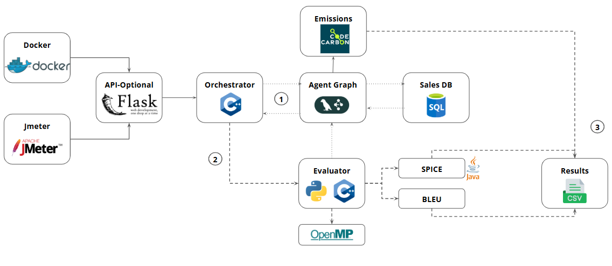
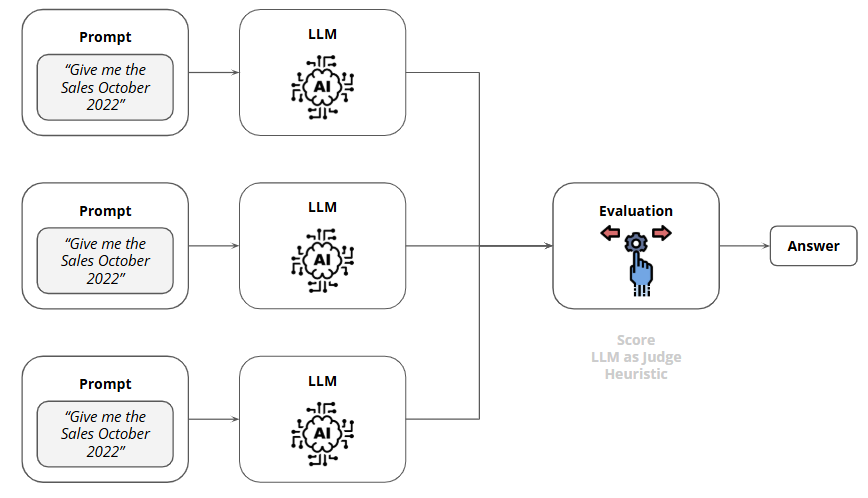
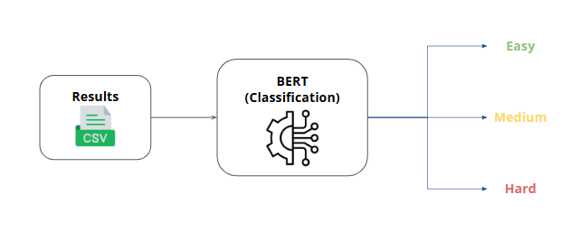
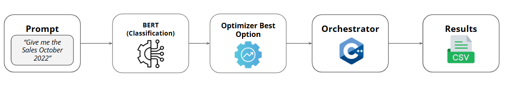
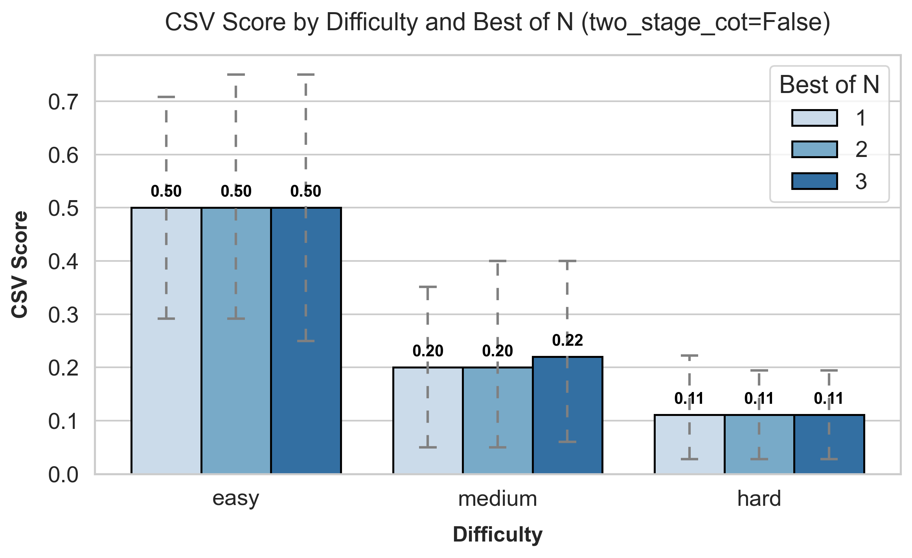
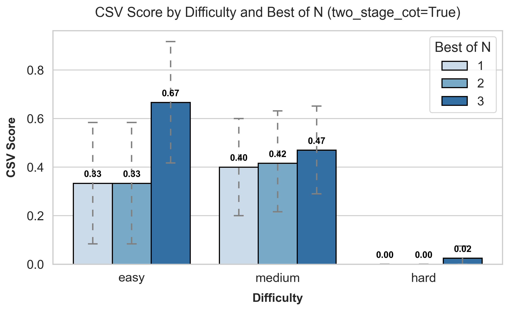
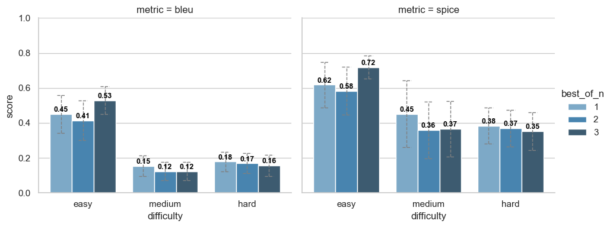
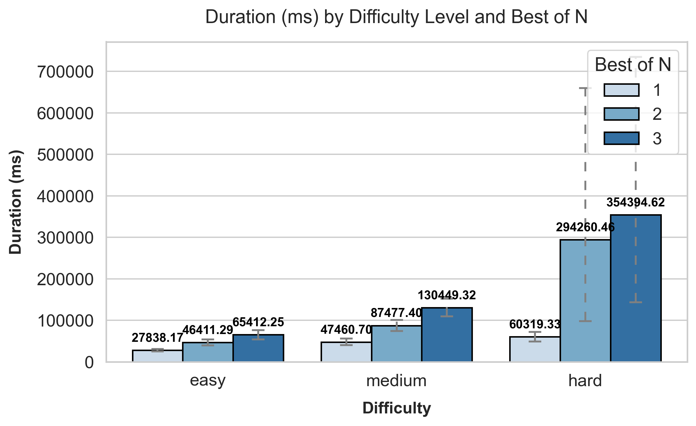
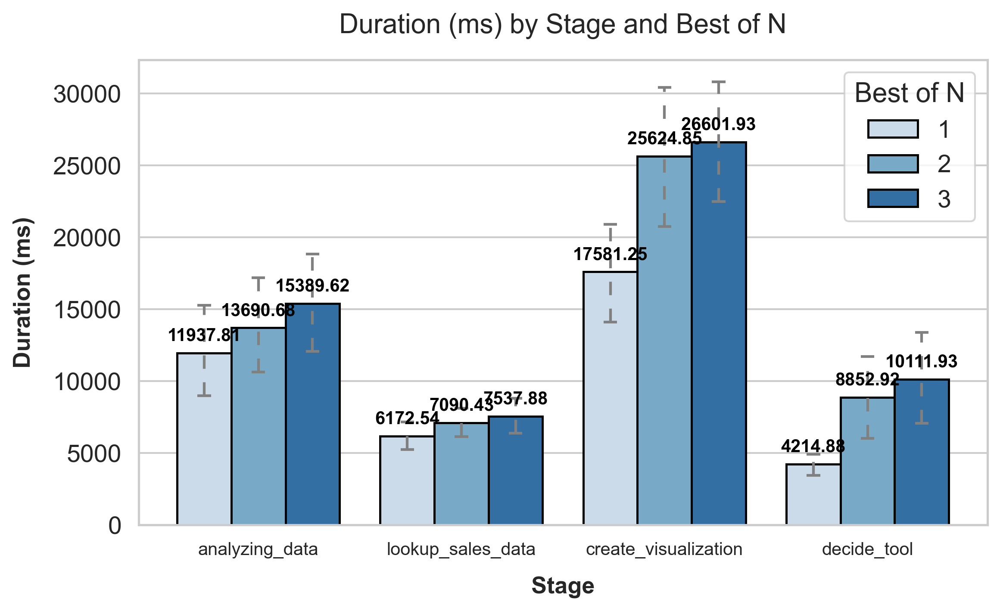
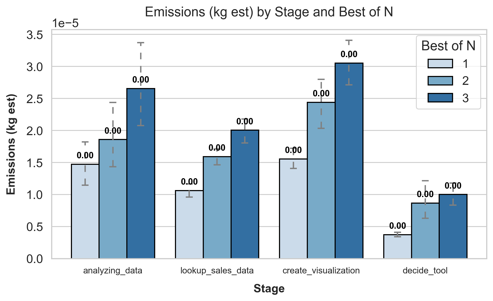

## Development and evaluation of AI
agentic workflows in LangGraph:
an energy and computational per-
formance analysis of DataAgen

<p align="center">
  
</p>

An LLM-powered agent that queries a local parquet dataset with DuckDB, analyzes the results, and generates visualization code. It uses a LangGraph workflow and supports **multiple LLM providers**:

- **Ollama (local, default)**: `llama3.2:3b`
- **OpenAI (ChatGPT models)**: e.g. `openai:gpt-4o-mini`
- **Anthropic (Claude models)**: e.g. `anthropic:claude-3-5-sonnet-latest`

### What it does
- Lookup: converts natural language into SQL via the LLM and runs it on DuckDB over the parquet file at `data/Store_Sales_Price_Elasticity_Promotions_Data.parquet`.
- Analyze: asks the LLM to summarize/interpret the results.
- Visualize: requests a minimal chart configuration and emits matplotlib code to plot it.


### Quickstart (local)
```powershell
python -m pip install -r requirements.txt
ollama serve
ollama pull llama3.2:3b
python -m Agent.data_agent "Show me the sales in Nov 2021" --goal "Sales trend for Nov 2021"
```

---

## Requirements
- Python 3.10+
- Ollama running locally (`https://ollama.com`) with a model pulled (default: `llama3.2:3b`) **OR** an API key for OpenAI/Anthropic
- Parquet file present at `data/Store_Sales_Price_Elasticity_Promotions_Data.parquet`

Install Python deps (from the project root):
```powershell
python -m pip install -r requirements.txt
```

---

## C++ config runner (recommended)

The **core workflow** for running experiments and sweeps is the C++ runner `agent_config_runner` (fast outer-loop orchestration, Python agent stays the inner-loop).

### Build C++ tools

The C++ tools live under `my_cpp/` and are built via CMake (C++17):
- `agent_config_runner` (batch/sweep runner)
- `resultcmp` (CSV comparator)
- `agent_config_runner_jmeter` (runner variant for JMeter workflows)

Build (from repo root):
```powershell
cmake -S my_cpp -B my_cpp/build -G "Ninja"  # or "Visual Studio 17 2022" on Windows
cmake --build my_cpp/build --config Release
```

### Run an experiment from YAML

Edit `config/agent_config.yaml`, then run:
```powershell
# Windows (PowerShell)
.\my_cpp\build\agent_config_runner.exe config\agent_config.yaml

# Linux/macOS
./my_cpp/build/agent_config_runner config/agent_config.yaml
```

Minimal example:
```yaml
prompt: "Show me the sales in Nov 2021"
visualization_goal: "Sales trend for Nov 2021"
agent_mode: "full"
save_dir: ./output
```

Batch / sweep modes are controlled by fields like `run_batch`, `test_cases_json`, and `sweep.*` in the YAML.

---

## Test-time compute strategies (visual overview)

This project evaluates three common inference-time strategies:
- **One-shot** (single run)
<p align="center">
  
</p>

- **Best-of-\(n\)** (multiple runs + select best by score)

<p align="center">
  
</p>

- **Two-stage CoT** (plan → execute)

<p align="center">
  
</p>

---

## Prompt difficulty → best config router (DistilBERT)

This repo includes an optional **prompt-only** classifier that predicts difficulty (**easy / medium / hard**) and then selects the **best-performing configuration** (by `csv_score`) for that difficulty based on prior sweep results.

<p align="center">
  
</p>

<p align="center">
  
</p>

### 1) Build the “best config by difficulty” table (from `evaluation/scores_runs.csv`)
```powershell
python -m evaluation.build_best_config_by_difficulty `
  --scores-csv evaluation/scores_runs.csv `
  --dataset-json evaluation/miguel.json `
  --out evaluation/best_config_by_difficulty.json
```

### 2) Fine-tune DistilBERT on your labeled prompts
First run will download `distilbert-base-uncased` from the Hugging Face Hub.

```powershell
python -m evaluation.train_difficulty_classifier `
  --dataset evaluation/miguel.json `
  --out-dir models/difficulty_distilbert
```

### 3) Route a new prompt → difficulty → recommended config
```powershell
python -m evaluation.prompt_config_router `
  --prompt "Which stores sold more than 1000 items in December 2021?" `
  --model-dir models/difficulty_distilbert `
  --config-map evaluation/best_config_by_difficulty.json
```

---

## Start Ollama locally

1) Install Ollama for your OS from `https://ollama.com/download`.

2) Pull a model (default used in code is `llama3.2:3b`):
```powershell
ollama pull llama3.2:3b
```

3) Start the Ollama server (keeps API on `http://localhost:11434`):
```powershell
ollama serve
```

4) Verify it is running:
```powershell
curl http://localhost:11434/api/version
ollama list
ollama ps
```

If you need to run against a remote server, ensure the API is reachable and set any required environment variables or update the code to point to the remote host.

---

## Project layout
```
DataAgent/
  Agent/
    data_agent.py        # SalesDataAgent class and LangGraph wiring
  evaluation/            # evaluation scripts + sweep logs + difficulty router
  my_cpp/                # resultcmp (C++ CSV comparator) + agent_config_runner (C++ runner)
  config/                # YAML configs for runner and experiments
  data/
    Store_Sales_Price_Elasticity_Promotions_Data.parquet
  LangChainAgent.ipynb   # Original notebook prototype
  README.md              # This file
```

---

## Using the agent

### From a Jupyter notebook
```python
from Agent.data_agent import SalesDataAgent

agent = SalesDataAgent(
    # Ollama (default): "llama3.2:3b"
    # OpenAI: "openai:gpt-4o-mini" (requires OPENAI_API_KEY)
    # Anthropic: "anthropic:claude-3-5-sonnet-latest" (requires ANTHROPIC_API_KEY)
    model="llama3.2:3b",
    temperature=0.1,
    max_tokens=2000,
    streaming=True,
)

result = agent.run(
    "Show me the sales in Nov 2021",
    visualization_goal="Sales trend for Nov 2021",
)

print("Final tool:", result.get("tool_choice"))
print("Chart config:", result.get("chart_config"))
print("Answer steps:", len(result.get("answer", [])))

# If the last answer is chart code, execute it to render the chart
if result.get("chart_config") and result.get("answer"):
    exec(result["answer"][-1], globals(), locals())
```

### From the CLI

The CLI is the same code path as the notebook/API, exposed as a module:

```powershell
python -m Agent.data_agent --help
```

Common examples:

```powershell
# Full pipeline (lookup + analysis + visualization)
python -m Agent.data_agent "Show me the sales in Nov 2021" --goal "Sales trend for Nov 2021"

# Lookup-only (SQL + data table)
python -m Agent.data_agent "Weekly sales in 2021" --lookup_only

# Analysis-only (no visualization)
python -m Agent.data_agent "Which stores sold more than 1000 items in Dec 2021?" --no_vis

# Two-stage plan -> final output
python -m Agent.data_agent "Top products by revenue" --two_stage_cot --cot_max_bullets 8

# Best-of-n (self-consistency) with a temperature schedule
python -m Agent.data_agent "Top products by revenue" --best_of_n 3 --temp 0.1 --temp-max 0.6
```

---

## Tracing with Phoenix (optional)

You can enable OpenInference/Phoenix tracing to visualize your agent runs (spans like AgentRun, tool_choice, sql_query_exec, data_analysis, gen_visualization).

### 1) Install tracing dependencies
```powershell
pip install arize-phoenix openinference-instrumentation-langchain opentelemetry-api
```

### 2) Choose where to send traces
- Self-hosted Phoenix (local): set endpoint to `http://localhost:6006/v1/traces`
- Phoenix Cloud: use endpoint `https://app.phoenix.arize.com/v1/traces` and your API key

### 3) Start Phoenix locally (self-hosted) (Only if running locally)
```powershell
phoenix serve
# or explicitly
# phoenix serve --host 0.0.0.0 --port 6006
```

Open the UI at `http://localhost:6006`.

### 4) Enable tracing in SalesDataAgent
```python
from Agent.data_agent import SalesDataAgent

# Self-hosted example
agent = SalesDataAgent(
    enable_tracing=True,
    phoenix_endpoint="http://localhost:6006/v1/traces",
    project_name="evaluating-agent",
)

# Cloud example
# agent = SalesDataAgent(
#     enable_tracing=True,
#     phoenix_endpoint="https://app.phoenix.arize.com/v1/traces",
#     phoenix_api_key="<YOUR_API_KEY>",
#     project_name="evaluating-agent",
# )

ret = agent.run("What was the most popular product SKU?")
```

Alternatively, set the endpoint via environment variable before creating the agent:
```python
import os
os.environ["PHOENIX_COLLECTOR_ENDPOINT"] = "http://localhost:6006/v1/traces"
from Agent.data_agent import SalesDataAgent
agent = SalesDataAgent(enable_tracing=True)
```

### 5) View your traces
- Self-hosted UI: open `http://localhost:6006`, go to Traces, select the project (default: `evaluating-agent`).
- Cloud UI: open `https://app.phoenix.arize.com`, Traces → select your project.

You should see spans named: `AgentRun`, `tool_choice`, `sql_query_exec`, `data_analysis`, `gen_visualization`.

### Troubleshooting tracing
- Verify the console shows: `[LangGraph] Starting LangGraph execution with tracing`.
- Confirm the endpoint includes `/v1/traces` and is reachable.
- Make sure dependencies are installed: `phoenix`, `openinference-instrumentation-langchain`, `opentelemetry-api`.
- For Cloud, ensure `phoenix_api_key` is set and valid.

### From the config runner
See the main section above: **“C++ config runner (recommended)”**.

---

## Optional: Evaluate results with a C++ comparator

Build the comparator (requires CMake):
```powershell
cd my_cpp
cmake -S . -B build -G "Ninja"  # or "Visual Studio 17 2022" on Windows
cmake --build build --config Release
cd ..
```

### Benchmark “optimized C++ (OpenMP)” vs “normal C++ (serial)”
The `resultcmp` binary supports:
- `--threads N` (OpenMP threads; `1` is effectively serial)
- `--benchmark` and `--benchmark-iters K` (runs an internal serial vs parallel micro-benchmark and prints timings in the JSON output)

Example (direct CLI):
```powershell
.\my_cpp\build\resultcmp.exe --actual .\output\test_1\run_data.csv --expected .\output\test_1\gt_data.csv --key "Store_Number,SKU_Coded" --threads 1
.\my_cpp\build\resultcmp.exe --actual .\output\test_1\run_data.csv --expected .\output\test_1\gt_data.csv --key "Store_Number,SKU_Coded" --threads 8 --benchmark --benchmark-iters 5
```

Run the agent and compare the produced CSV with an expected CSV (C++ comparator):
```yaml
prompt: "Weekly sales in 2021"
agent_mode: "lookup_only"
save_dir: ./results/weekly_sales_2021
gt_csv: "C:/path/to/expected.csv"
enable_csv_eval: true
csv_eval_method: "cpp"
cpp_evaluator:
  executable: "./my_cpp/build/resultcmp.exe"
  keys: "week,store_id"
  threads: 8            # OpenMP threads (if available)
  benchmark: true       # add serial-vs-parallel benchmark to the JSON output
  benchmark_iters: 5
```

The final returned dict will include an `evaluation` field like:
```json
{
  "equal": true,
  "row_count_actual": 1245,
  "row_count_expected": 1245,
  "mismatched_rows": 0,
  "mismatched_columns": [],
  "duration_ms": 37,
  "exit_code": 0
}
```

---

## Run with Docker

Build the image (from project root):
```powershell
docker build -t data-agent .
```

Build explicitly with this Dockerfile (if building from elsewhere):
```powershell
docker build -f Dockerfile -t data-agent .
```

Run (Docker Desktop on Windows/macOS):
```powershell
docker run --rm -e OLLAMA_HOST=http://host.docker.internal:11434 `
  data-agent "Show me the sales in Nov 2021" --goal "Sales trend for Nov 2021"
```

Run (Linux host, replace with your host IP or network alias):
```bash
docker run --rm -e OLLAMA_HOST=http://192.168.1.10:11434 \
  data-agent "Top products by revenue"
```

Use a custom parquet by mounting it over the default path inside the container:
```powershell
docker run --rm -e OLLAMA_HOST=http://host.docker.internal:11434 `
  -v C:\path\to\your.parquet:/app/data/Store_Sales_Price_Elasticity_Promotions_Data.parquet `
  data-agent "Show weekly sales trend in 2021"
```

Override the entrypoint (run any Python you want inside the image):
```powershell
docker run --rm -it --entrypoint bash data-agent
# inside the container:
python -m Agent.data_agent "Top products by revenue" --goal "Top-5"
```

Notes:
- The container expects an Ollama server to be reachable at `OLLAMA_HOST`.
- Default `ENTRYPOINT` is `python -m Agent.data_agent`; any arguments after the image name are passed to the agent.

---

## Docker: run experiments with `agent_config_runner` (recommended for containerized sweeps)

If you want to run the **C++ config runner** inside Docker (so C++ + Python deps are fully reproducible), use `Dockerfile.runner`.

### Build
```powershell
docker build -f Dockerfile.runner -t data-agent-runner .
```

### Run a YAML experiment / sweep
Mount an output folder and a config YAML into the container:
```powershell
$outDir = "$PWD\\output\\docker_runner"
New-Item -ItemType Directory -Force -Path $outDir | Out-Null

docker run --rm -it `
  -e OLLAMA_HOST=http://host.docker.internal:11434 `
  -v "${outDir}:/app/output" `
  -v "$PWD\\config\\agent_config_exp1_bestof_sweep_docker_no_spice.yaml:/app/config.yaml" `
  data-agent-runner /app/config.yaml
```

Important:
- For Docker/Linux, your YAML must not reference a Windows venv like `.venv\\Scripts\\python.exe`. Use `python_bin: "python3"` or omit `python_bin` (Linux default is `python3`).
- The provided Docker config already sets `save_dir: /app/output/...` so results persist on the host.
- If you use a custom parquet, mount it over the default path `/app/data/Store_Sales_Price_Elasticity_Promotions_Data.parquet`.

### Useful C++ runner flags

All C++ binaries now support `--help`:

```powershell
.\my_cpp\build\agent_config_runner.exe --help
.\my_cpp\build\agent_config_runner_jmeter.exe --help
.\my_cpp\build\resultcmp.exe --help
```

---

## Download and Install Apache JMeter

To perform load testing and performance analysis, you may want to use Apache JMeter. Follow these steps to download and install JMeter:

1. **Download JMeter:**
   - Visit the [Official Apache JMeter website](https://jmeter.apache.org/download_jmeter.cgi).
   - Download the binary archive for your operating system (e.g., `apache-jmeter-5.4.1.zip`).
   - Make sure to install java+8 [Java Download](https://www.java.com/en/download/manual.jsp)

2. **Extract the Archive:**
   - Extract the downloaded ZIP to any directory (your JMeter home).

3. **Run JMeter:**
   - Navigate to the `bin` directory of your JMeter installation.
   - Execute the following command to start JMeter's GUI:
     - **Windows**:
       ```bash
       jmeter.bat
       ```
     - **macOS/Linux**:
       ```bash
       ./jmeter
       ```

4. **Verify the Installation:**
   - Once JMeter starts, you should see the JMeter interface.
   - You can now create test plans and perform load testing.

---

## Configuration
- Change model: pass `model="<name>"` to `SalesDataAgent(...)`.
- Custom parquet: pass `data_path="..."` in the constructor, or use `--data` in CLI.
- Visualization goal: pass `visualization_goal="..."` to `run()` or `--goal` in CLI.

### LLM provider configuration (models)
- **Ollama (default)**: `--model "llama3.2:3b"` (requires Ollama running; can override host with `OLLAMA_HOST`)
- **OpenAI**: `--model "openai:gpt-4o-mini"` (requires `OPENAI_API_KEY`)
- **Anthropic**: `--model "anthropic:claude-3-5-sonnet-latest"` (requires `ANTHROPIC_API_KEY`)

Environment variables (PowerShell):
```powershell
$env:OPENAI_API_KEY="YOUR_KEY"
$env:ANTHROPIC_API_KEY="YOUR_KEY"
$env:OLLAMA_HOST="http://localhost:11434"
```

---

## Run as an HTTP API (Flask)
Start the server:
```powershell
python agent_api.py
```

Call the agent (example: lookup-only, best-of-n, save CSV, compare IoU):
```powershell
$body = @{
  prompt = "What were the sales in November 2021?"
  lookup_only = $true
  best_of_n = 5
  best_of_n_temp_min = 0.0
  best_of_n_temp_max = 0.6
  output_csv = "results/sales_november_2021.csv"
  expected_csv = "results/real_sales_november_2021.csv"
} | ConvertTo-Json

Invoke-RestMethod -Method Post -Uri "http://127.0.0.1:5000/call-agent" -ContentType "application/json" -Body $body
```

Use the C++ comparator via the API by adding:
- `evaluator_exe`: e.g. `".\my_cpp\build\resultcmp.exe"`
- `eval_keys`: e.g. `"week,store_id"`

---

## Optional: SPICE (Java) for analysis-text evaluation

SPICE is a **semantic scene-graph** metric originally designed for **image captions**. You *can* apply it to short, caption-like analysis outputs, but it may be noisy on long analytical text.

### Prerequisites
- **Java** installed (`java -version`)
- A SPICE jar file (e.g., `spice-1.0.jar`) downloaded from the official SPICE page: `https://panderson.me/spice/`.

### Stanford CoreNLP dependency (required by SPICE)
SPICE relies on Stanford CoreNLP. If you download SPICE without bundled CoreNLP jars (common), install them like this:

1) Download **Stanford CoreNLP 3.6.0** from the CoreNLP release history:
`https://stanfordnlp.github.io/CoreNLP/history.html`

2) From the downloaded CoreNLP archive, copy at least these jars into your SPICE folder:
- `stanford-corenlp-3.6.0.jar`
- `stanford-corenlp-3.6.0-models.jar`

Recommended destination:
- `SPICE-1.0/lib/` (next to `spice-1.0.jar`)

Notes:
- `*-sources.jar` and `*-javadoc.jar` are optional (not needed at runtime).

### Config runner example (analysis + SPICE)
```yaml
prompt: "What were the sum of sales in November 2021?"
agent_mode: "analysis"
save_dir: ./output
gt_text: "./results/expected_analysis.txt"
enable_text_eval: true
text_eval_method: "spice"
spice:
  jar_path: "spice/spice-1.0.jar"
  java_bin: "java"
```

### API example (SPICE)
```json
{
  "prompt": "What were the sum of sales in November 2021?",
  "analyze_only": true,
  "expected_analysis": "…ground truth…",
  "analysis_metric": "spice",
  "spice_jar": "spice/spice-1.0.jar",
  "spice_java_bin": "java"
}
```

---

## Troubleshooting
- Check Ollama is up:
  - `curl http://localhost:11434/api/version`
  - `ollama list` and `ollama ps`
- Ensure the model is pulled (e.g., `ollama pull llama3.2:3b`).
- If you see connection errors, confirm no firewall is blocking `localhost:11434`.
- If SQL fails, skim the printed `data`/columns and adjust the prompt (e.g., include date formatting hints like `CAST(date_col AS VARCHAR)`).

---

## High-level LangGraph flow
1. Decide tool (LLM): choose lookup → analyze → visualize → end.
2. Lookup (DuckDB): parquet → temp table → LLM SQL → query → text table in state.
3. Analyze (LLM): summarize/answer with reference to the result data.
4. Visualize (LLM): emit compact config → generate matplotlib code to plot.

<p align="center">
  
</p>

The agent exposes a single `run(prompt, visualization_goal=None, initial_state=None)` entry point and returns the final state with an ordered `answer` list (analysis and then chart code when applicable).

---

## Energy and emissions (CodeCarbon)

This project integrates [CodeCarbon](https://mlco2.github.io/codecarbon/) to estimate energy usage and CO₂ emissions for each agent run.

- Enabled inside `SalesDataAgent.run(...)` via `EmissionsTracker`.
- Every execution writes a row to `codecarbon/emissions.csv` in the current working directory.

Install (already included if you use the project requirements):
```powershell
pip install -r requirements.txt
# or
pip install codecarbon
```

Run the agent as usual (CLI or API). After a run, inspect the log:
```powershell
Get-ChildItem codecarbon
type codecarbon\emissions.csv
```

Optional dashboard (Carbonboard):
```powershell
carbonboard --filepath "codecarbon/emissions.csv" --port 8050
```
Open `http://localhost:8050/`.

Notes:
- On Windows, CodeCarbon works without special drivers; it may use modeled power if sensors are unavailable.
- Logs are estimates; keep the machine plugged in and avoid heavy background tasks for more stable readings.


## Building agent_config_runner
See: **“C++ config runner (recommended)”** (build + usage + YAML examples).

---

## Results & key findings

The plots in `results/` are generated from controlled sweeps over **test-time compute** knobs:
- **best-of-\(n\)** (self-consistency via repeated runs + selection)
- **two-stage CoT** (Plan → Final)

### CSV accuracy by difficulty (two-stage CoT = False / True)

<p align="center">
  
</p>

<p align="center">
  
</p>

### Text quality by difficulty (BLEU vs SPICE)

<p align="center">
  
</p>

### Cost by difficulty (end-to-end duration)

<p align="center">
  
</p>

### Stage-level cost (duration and emissions)

<p align="center">
  
</p>

<p align="center">
  
</p>

### Key findings (summary)

- **Best-of-\(n\) alone gives limited CSV gains**: without two-stage CoT, `csv_score` is largely flat across \(n\) (easy/medium), with hard remaining low.
- **Two-stage CoT enables best-of-\(n\) improvements**: with Plan → Final, `csv_score` increases with \(n\) (especially \(n=3\)) for easy/medium prompts, while hard prompts remain near-zero.
- **Latency grows with \(n\)** and spikes on hard prompts: repeating full runs increases end-to-end time roughly proportionally, but hard prompts show much larger jumps at higher \(n\).
- **`create_visualization` dominates stage cost when present**: stage-level logs show `create_visualization` as the main contributor to duration and emissions, followed by `analyzing_data`; `lookup_sales_data` is consistently smaller.
- **SPICE stays higher than BLEU** across difficulties: semantic overlap is often preserved even when surface \(n\)-gram overlap drops; best-of-\(n\) helps most on easy prompts, with smaller (sometimes negative) changes on medium/hard.

This matches recent agent-scaling results showing that “more coordination/agents” helps primarily when it aligns with task structure (parallelizable vs sequential) rather than universally improving performance (Kim et al., 2025) at [Google Research](https://research.google/blog/towards-a-science-of-scaling-agent-systems-when-and-why-agent-systems-work/).
